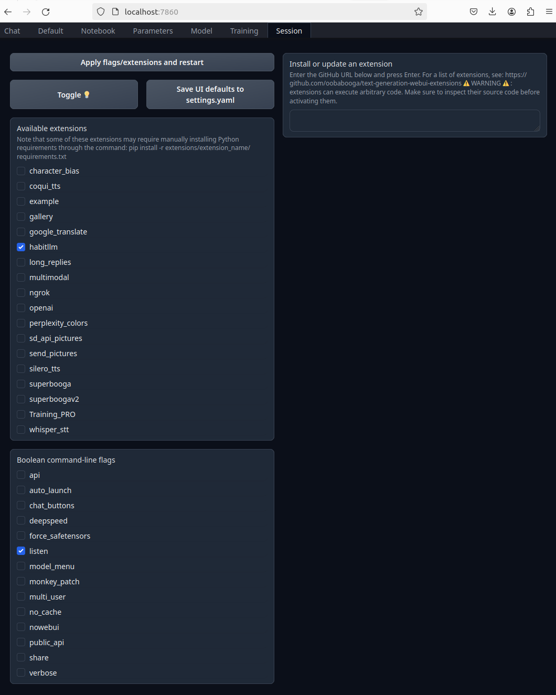

# HabitLLMs

Repo for CS886 - Foundation Models course project. Continuous learning with memory of interactions and meta-optimized learning.
HabitLLMs is a continous learning frameworks to adapt language models based on evolving user needs expressed through chat sessions.

This instantiation of the system forms an extension for [oobabooga/text-generation-webui](https://github.com/oobabooga/text-generation-webui.git). Our system is designed to be modular to encourage hot swapping component implementations and developers to adapt the extension to their needs.

## Project Organization

The following directory tree shows the notable folders/files in the project.

    HabitLLMs/
    |
    ├── .devcontainer/                              <- VS Code dev-containers integration files.
    ├── config/                                     <- Additional config files.
    ├── data/                                       <- Storage directory for experiment datasets.
    ├── notebooks/                                  <- Jupyter notebooks. Naming convention is a number (for ordering), 
    │                                                  the creator's initials, and a short `-` delimited description, e.g. 
    │                                                  `1.0-jr-initial-data-exploration`.
    ├── scripts/                                    <- Misc scripts for experiment support or data processing.
    |
    ├── docker/                                     <- Docker compose files for the project.
    │   ├── .dockerignore                           <- .dockerignore file. Controls what is pulled into the image during creation
    │   ├── docker-compose.yml                      <- Primay docker-compose file for HabitLLM system. Used to create 
    |   |                                              containers for system components/modules and launch the webui.
    │   ├── .env.example                            <- Example .env file for project. 
    │   └── webui-compose.override.yml              <- Overriding config for creating oobabooga/text-generation-webui image. 
    |                                                  Enables additional volume mounting, docker context redirection to reduce 
    |                                                  file movement, and networking between webui and other components.
    |
    ├── habitllm/                                   <- Main extension directory. habitllm source code.
    │   ├── inference_specific_context_module/      <- Module that allows users to provide additional documents as context to system.
    │   ├── interaction_memory_module/              <- Module for interaction tracing/logging and storage in db.
    │   ├── model_persistent_context_module/        <- Module providing model with non-parametric capabilities. Stores embeddings 
    |   |                                              of relevant context.
    |   ├── persistent/                             <- Default persistent storage location once extension copied into text-generation-webui.
    │   ├── __init__.py                             <- Makes package pip installable for development and debugging (pip install -e .).
    │   ├── requirements.txt                        <- Requirements for part of system that lives in webui container.
    │   └── script.py                               <- Entrypoint to extension from webui. Contains overriding functions to modify 
    |                                                  the webui's base behaviour. Main source of context buffer management and 
    |                                                  chat interface changes.
    |                                                 
    ├── text-generation-webui/                      <- (git submodule) oobabooga/text-generation-webui. Facilitates chat interface and 
    |   |                                              other webui elements for loading + training models.
    |   | ...
    │   ├── cache/                                  
    │   │   └── infererence_context_upload_dir/     <- (created by habitllm) Upload directory for user provided document context.
    │   ├── extensions/                             <- (habitllm goes here!) Location for webui extensions.
    │   ├── loras/                                  <- Saved loras and other adaptors.
    │   ├── models/                                 <- Saved model checkpoints for webui inference.
    |   ├── instruction_templates/                  <- Bin for instruction templates.
    │   ├── prompts/                                <- Bin for custom prompt templates.
    |   ├── training/                               <- Datasets and formats for training with webui.
    │   ├── LICENSE                                 <- License saying we can use oobabooga.
    │   ├── CMD_FLAGS.txt                           <- (overwrite) Default CMD_FLAGS.txt file. Controls args to launch webui.
    │   └── server.py                               <- Primary logic for webui gradio app. This is what habitllm/script.py modifies.
    |
    ├── .gitignore
    ├── .gitmodules                                 <- .gitmodules file for versioning oobabooga/text-generation-webui as a submodule.
    ├── CMD_FLAGS.txt                               <- HabitLLM's intended CMD_FLAGS.txt. Used to overwrite text-generation-webui/CMD_FLAGS.txt
    ├── environment.yml                             <- Conda environment.yml specification for development container.
    ├── Makefile                                    <- Makefile for repo automation.
    ├── pyproject.toml                              <- Makes package pip installable and contains project metadata.
    ├── README.md                                   <- This file, guide for installation + usage of habitllm implementation.
    └── requirements_dev.txt                        <- Development container requirements.

## Installing habitllm system

We designed this project to run in docker to increase reproducability of our setup and encourage futher development. While the instillation of habitllm can technically be done without containerizing the system, it is intended to be run in containers.

### Requirements

* [Docker version 17.06.0 or later](https://docs.docker.com/install/#support)
* [NVIDIA Container Toolkit](https://docs.nvidia.com/datacenter/cloud-native/container-toolkit/latest/install-guide.html) if running on NVIDIA GPUs

### Setup Steps

1. Clone repository and move into it

    ```bash
    git clone https://github.com/jamesRiddell1/HabitLLMs
    cd HabitLLMs
    ```

2. Fetch oobabooga/text-generation-webui with the following commands

    ```bash
    git submodule init
    git submodule update
    ```

3. Copy habitllm extension into text-generation-webui's extensions directory

    ```bash
    cp -r habitllm text-generation-webui/extensions/.
    ```

4. Setup docker environment following steps below:

    1. Enter text-generation-webui directory

        ```bash
        cd text-generation-webui
        ```

    2. Set desired compute device (nvidia, amd, cpu, intel)

        ```bash
        COMPUTE_DEVICE=nvidia
        ```

    3. Create sym links for oobabooga docker elements

        ```bash
        ln -s docker/${COMPUTE_DEVICE}/Dockerfile .
        ln -s docker/${COMPUTE_DEVICE}/docker-compose.yml webui-compose.yml
        ```

    4. Create sym links to habitllm docker elements

        ```bash
        ln -s ../docker/{docker-compose.yml,webui-compose.override.yml,.dockerignore} .
        ```

    5. Prepare .env file
        .env files store environment variables used for the docker image construction. Modify the variables according to your needs.

        ```bash
        cp ../docker/.env.example .env
        nano .env
        ```

    6. Replace CMD_FLAGS.txt with the one in HabitLLM parent repo

        ```bash
        \cp ../CMD_FLAGS.txt .
        ```

    7. Create volume mounts for the containers and make all of them writable.

        ```bash
        mkdir -p .cache cache characters extensions loras logs models presets prompts softprompts training cloudflared
        chmod a+w .cache cache characters extensions loras logs models presets prompts softprompts training cloudflared
        ```

    8. Build images and startup docker containers

        ```bash
        docker compose up --build
        ```

    9. By default, text-generation-webui does not install any third-party extensions during it's initial installation. Since we do not want to modifiy (and thus need have to version their Dockerfile which changes frequently) directly, we need a few more steps to get HabitLLM up and running.
    
        1. In another terminal exec into the webui container as root user.

            ```bash
            docker compose exec -it -u root text-generation-webui "/bin/bash"
            ```

        2. Inside the container run the following to install habitllm's dependencies in the webui's conda env.
   
            ```bash
            ./cmd_linux.sh
            pip install -r extensions/habitllm/requirements.txt
            ```

            **During this you may see a message about dependecy conflicts on pandas, however this is for a package we do not leverage, so it not being updated doesn't interfere with habitllm.

            Once done with these commands users can exit the container by typing `exit` twice.

        3. Open the webui in browser, go to the session tab, and click apply flags/extensions and restart button
            

With that you should be all setup :D !

### Usage

#### Toggling habitllm extension on/off

At any point in time the extension can be toggled off by deselecting it in the webui's settings tab or by commenting out the line in CMD_FLAGS.txt.

#### Stop habitllm containers

Containers can be stopped without destroying them to reduce the time needed to launch the system. This can be done with the following command
    ```
    docker compose stop
    ```

#### Restarting stopped containers

Stopped containers can be restarted with
    ```
    docker compose start
    ```

#### Loading models

Loading models can be done through the models tab of text-generation-webui. For more information see [oobabooga documentation on models tab](https://github.com/oobabooga/text-generation-webui/blob/main/docs/04%20-%20Model%20Tab.md#model-dropdown).

### Chatting with models.

The oobabooga chat ui provides users with the ability to chat in three modes, chat, instruct, and chat-instruct. Depending on your choice of model certian modes are more appropriate. We reccommend chat-instruct for HabitLLMs purposes. See more information at [oobabooga documentation on chat tab](https://github.com/oobabooga/text-generation-webui/blob/main/docs/01%20-%20Chat%20Tab.md)

Scrolling down the chat ui will reveal the UI components we designed for HabitLLMs, which provides the main ways to interact with the user part of the system.

## Docker support for project

We designed this project to support docker to increase reproducability of our setup and encourage futher development. To do so, we expose a Makefile with serveral commands to interact with docker. The Makefile borrows from [cookiecutter-docker-science](https://docker-science.github.io/), so feel free to check out that project for more info.
